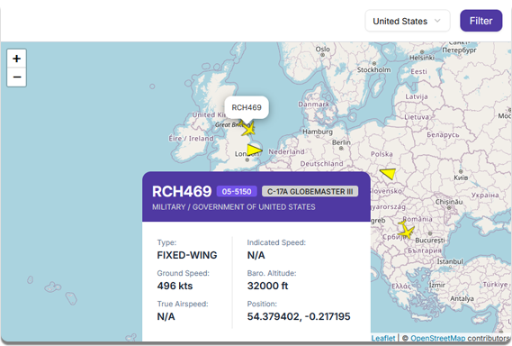

# FlyMil

A live tracking tool for government and military aircraft. This project leverages unfiltered ADS-B, Mode S and MLAT feeders provided enthusiasts. This tool provides a user-friendly interface to monitor different countries government and military movements in the air.



## Information

FlyMil uses the [ADS-B Exchange API](https://adsbexchange.com/) to retrieve real-time data of military aircraft. ADS-B exchange collects data from a worldwide network of ADS-B receivers, ensuring comprehensive coverage and accurate information. If you're interested in learning more about what ADS-B is then I recommend this [video](https://www.youtube.com/watch?v=F-v54MlxMIo).

## Features

TBD

## Installation

Use `npm` to install the required dependencies.

```cmd
npm install
```

FlyMil uses the [ADS-B Exchange API](https://adsbexchange.com/) so to run the project successfully you will have to purchase an API key.
